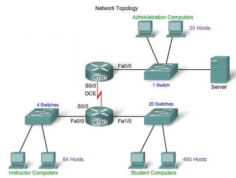

# Networking 101 basics and software-defined networks

This lab provides an introduction to networking and software-defined networks (SDN).

## Objective

The objective of this lesson is to teach the following concepts:

* Networking basics: What is a network?
* Routers and switches: The devices required to create, maintain, and connect to a network.
* SDN and REST: How do these concepts apply to networking?

## Prerequisites

To complete this lab, you need

* Basic coding knowledge. You may want to complete the DevNet [Intro to Coding Fundamentals](https://learninglabs.cisco.com/modules/fundamentals) modules before proceeding.

## Additional Information

* Online networking tutorials: [Cisco Learning Network Store](https://learningnetworkstore.cisco.com/) and [Cisco Learning Network](https://learningnetwork.cisco.com/welcome).
* Videos: [Cisco DevNet YouTube](https://www.youtube.com/ciscodevnetchannel/).
* Books: [Cisco Press](http://www.ciscopress.com/).

## Step 1. What is a Network?

A network consists of host devices such as computers, mobile devices, and printers that are connected by networking devices such as switches and routers. The network enables the devices to communicate with one another and share data.

*Simple Local Area Network (LAN)*

In this diagram, data from the student computer to the instructor computer travels through the switch to the router (FastEthernet Interface 1/0), then to the next switch (FastEthernet Interface 0/0), and finally to the instructor computer.

As you proceed through this lab, you will learn the answers to the following questions:
* Why do some devices work on networks and others do not?
* How do devices find each other?
* What are switches, routers, and interfaces and how are they configured?
* How do REST and SDN relate to this information?

**Next:**  Learn about the devices that are required for a network.
