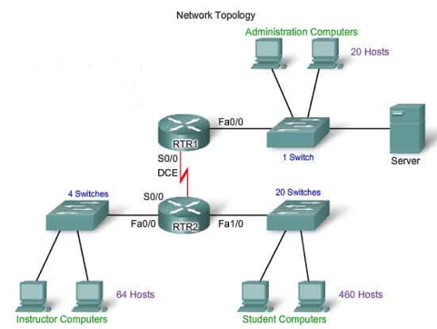
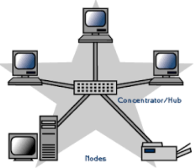

# Step 3: Understand how devices find each other

This step describes the processes behind the scenarios in Step 1 and Step 2.

## Revisiting the Step 1 scenario: routers and switches

In the Step 1 scenario, the network completes the following processes when a student sends a message to the instructor.

*Simple Local Area Network (LAN)*

The student computer needs to know the IP address of the instructor's computer. In this example, the IPv4 address of the instructor's computer is 171.16.16.1 and the address of the student computer is 172.16.254.1. The network switch and router complete the following processes to send the data.

1. **Process One: ARP Cache**: The switch receives the message request and looks in its [ARP cache](http://networkengineering.stackexchange.com/questions/5023/what-is-the-main-purposes-of-arp-cache-in-the-switch) for the MAC address associated with IP 171.16.16.1. If the switch locates the MAC address and other identifying information, it sends the student message to the instructor computer. If the switch does not have the MAC address in its cache, it initiates the next process.
2. **Process Two: ARP request**: The switch uses a protocol called [Address Resolution Protocol (ARP)](https://en.wikipedia.org/wiki/Address_Resolution_Protocol) to [broadcast](https://en.wikipedia.org/wiki/Broadcasting_%28networking%29) an *ARP request* to look for the IP address 171.16.16.1 on all network devices. If one of the devices has that IP address, the device sends an *ARP response* that identifies itself and includes the MAC address. The switch then passes the message to that device. However, if no devices connected to that switch have a matching IP address, the switch initiates the next process..
3. **Process Three: Router** The switch sends the message request to the router. The router looks in its routing table and determines the appropriate switch to which to send the data. In this example, it passes the data to the Instructor Switch. The Instructor Switch repeats *Process One* and possibly *Process Two* until it identifies the instructor computer and passes the data.

## Revisiting the Step 2 scenario: switch or hub

Step 2 described an office network in which computers and a printer were connected by a switch or a hub. This simple network does not include a router, but may connect the devices via a switch or a hub.

*Office Network*

In the switch scenario, a computer must be able to identify the IP address of the printer. Because there is no router in this network, the IPv4 addresses for all devices must be on the same [network segment](https://en.wikipedia.org/wiki/Network_segment# Ethernet) so that they can find each other.  To be "on the same segment" means that an IPv4 address can be found without the need to route to another network segment.

In this example, the IPv4 address of the printer is 172.16.254.5 and the user's computer's IPv4 address is 172.16.254.1. When the user attempts to send data to the printer, the swich performs the following processes.

1. **Process One: ARP cache**: The switch receives the data and looks in its ARP cache for the MAC address associated with 171.16.254.5. If the switch locates the MAC address and other identifying information, it sends the data to the printer. If the switch does not have the MAC address in its table, it initiates the next process.
2. **Process Two: ARP request**: The switch sends an ARP Request to look for the IP address 171.16.254.5. The printer receives the request and sends an ARP Response that identifies itself and includes the MAC address. The switch sends the data to the printer.

A hub, also known as a repeater, is less sophisticated than a switch. It sends, or repeats, all data that it receives to all devices that are connected to it.

1. **Process: Data repetition**: The hub receives the data and sends it to every device that is connected to it. If one of the devices has the matching IP address, it will respond.

Hubs are less efficient than switches, because they do not have an ARP cache and cannot use ARP. Hubs always broadcast data to all ports, which can saturate the network, consume bandwidth, and make computers reject data.

Many switches have a feature called [microsegmentation](https://en.wikipedia.org/wiki/Network_switch# Microsegmentation) that provides the same bandwidth to all connected devices. However, with a hub, all connected devices must share a limited amount of bandwidth. With microsegmentation, network traffic flows smoothly without [collisions](http://searchnetworking.techtarget.com/definition/collision).

Finally, switches often provide many configuration optioons, while hubs offer little or no configuration.

## Ideas to consider

1. If a switch is more efficient than a hub, why would you buy a hub?

2. Now that you understand ARP, look up [RARP](http://searchnetworking.techtarget.com/definition/Reverse-Address-Resolution-Protocol) and determine when that protocol might be used.

**Next Step:**  Understanding and configuring switches, routers, and interfaces
