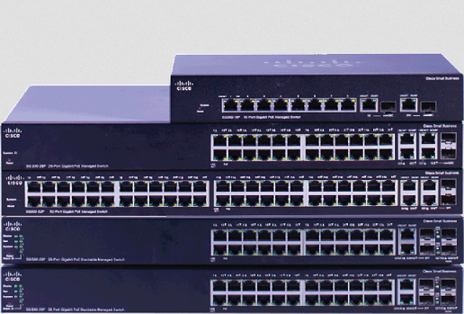
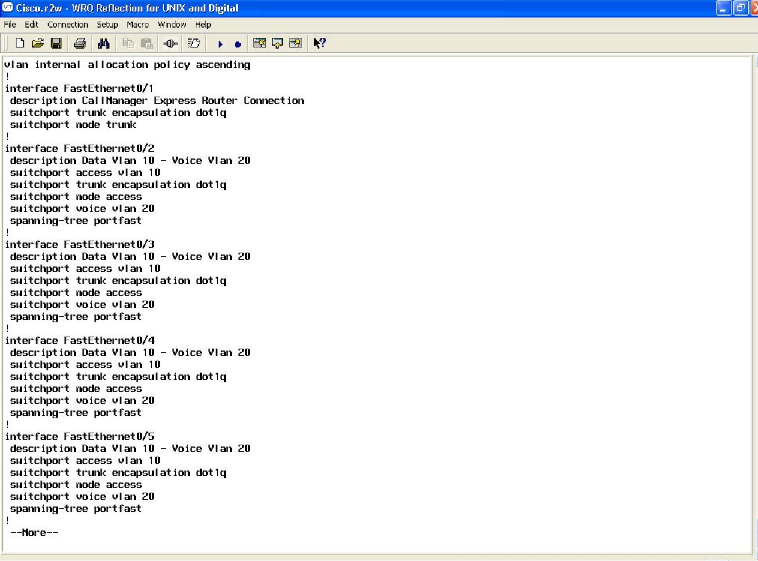
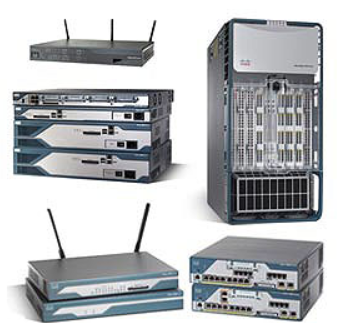
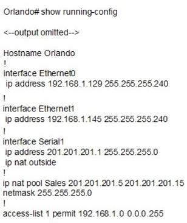

# Step 4: Understand and configure switches, routers, and interfaces

This step describes the characteristics of switches and routers in more detail, as well as how these devices use interfaces.

## Switch characteristics and behavior

*Various Cisco Switches*

A switch is a [Layer 2 (Data Link Layer)](https://en.wikipedia.org/wiki/Data_link_layer) device, so most interfaces do not have IPv4 addresses. Note: Layers will be covered in another Learning Lab.

Switches have the following characteristics:

* RJ45 ports connect to other devices such as a router, switches, and other network hosts (e.g., computers and printers). Each port has a configurable software interface.
* ARP determines with which device it should exchange data.
* Microsegmentation prevents network data collisions and improves traffic flow.
* Interfaces can be configured to create networks such as [Virtual LANs (VLANs)](https://en.wikipedia.org/wiki/Virtual_LAN). (This type of configuration is not covered in this Learning Lab.)

The following diagram shows a sample configuration of a switch's interfaces. Notice that no IP addresses are present.

*Sample Switch Configuration*

## Router characteristics and behavior

*Various Cisco Routers*

A router is a [Layer 3 (Network Layer)](https://en.wikipedia.org/wiki/Network_layer) device. Most of its interfaces have IPv4 addresses.

Routers have the following characteristics:

* RJ45 ports connect to other routers or switches. Each port has a configurable software interface.
* A routing table determines which switch or router should receive data. It routes data to the proper network device.
* Interfaces and other features such as routing tables, and network address translation can be configured by an administrator. Configuration is not covered in this Learning Lab.

The following diagram shows a sample configuration of a router's interfaces. Notice that each interface has an IP address.

*Sample Router Configuration*

## Interfaces

Each physical RJ45 portal has at least one interface that can be configured. A network engineer can configure and activate or deactivate an interface via a terminal or command line interface. Configuration commands can be extensive. They support creating virtual interfaces, trunk ports, virtual LANs, attaching policies and functionality to various interfaces, and more.

## Revisit the Step 1 scenario

You can now relate your understanding of switches, routers, and interfaces back to the network example in Step 1.

*Simple Local Area Network (LAN)*

This network example has the following characteristics:

* All of the connections between network devices use Ethernet cables.
* Starting from the bottom, right to left, the student network host computers connect to the RJ45 ports on the switch. Each of the portals has an interface (not shown).
* A port on the switch connects to the router's (RTR2) RJ45 port, defined by the FastEthernet1/0 interface.
* The router (RTR2) connects to another router (RTR1), which, in this case, is through a portal defined by a Serial0/0 interface.
* The router (RTR2) also connects to a switch through its portal, which is defined by a FastEthernet0/0 interface.
* The switch connects to the Instructor network host computers through its RJ45 ports. Each of these ports has an interface (not shown).
7. Bear in mind that each of the network host devices has interfaces with defined IP addresses as well.

## About network engineers
Network engineers are responsible for configuring the interfaces and other features of these hardware devices. Some of this information can be configured dynamically, but that must be enabled by a network engineer. Network engineers also perform all of the physical wiring, connecting devices using Ethernet cable.

## Questions to consider
* Through which hardware devices do the student computers communicate with the administration computers?
* If a student computer wants to send information to an administration computer, what information does it need to start? What are the possible processes used to find the administration computer?
* What could happen if a network engineer misconfigures a device by assigning the wrong IP address to it or connecting it to the wrong portal?

**Next Step:**  Understanding REST and SDN in the context of networking
