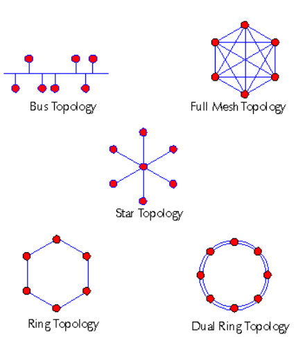

# Step 1. Physical and Logical Topologies

Every network has a physical and logical topology.

## Physical topologies

The physical topology represents the physical layout of the network. Here are some pictures of physical topologies.

*Network Physical Topologies*

**Bus**: Host devices are connected to one centralized cable or hardware device by twisted pair wiring. Network data travel is bi-directional, which means that data can collide.

**Full Mesh**: All devices are connected to each other for redundancy. This network is the most reliable. However, the extensive wiring means that it is also the most expensive and difficult to set up. You can create a partial mesh topology as an alternative.

**Star**: A central device connects to network and host devices using twisted pair wiring.

**Ring**: All devices are connected using a single cable and data is routed through each device. The data travels in a single direction until it reaches its intended target. This topology averts network collisions, but is susceptible to failure if a single node fails.

**Dual Ring**: Two rings enable data to be sent in opposite directions, creating redundancy. If one ring fails, the other continues to transmit data.

## Logical topologies

The logical topology is a virtual representation of how the physical topology operates, and is not necessarily identical to the physical topology. For example, a network's physical topology might be laid out in the form of a star topology, but its logical operation functions like a ring topology.

## Questions to Consider

1. What are some other network physical topologies?
2. Compare the Bus and Ring Topologies. What are the advantages/disadvantages of each?

**Next Step:**  Understand network wiring and cables.
