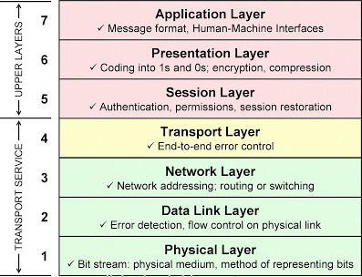
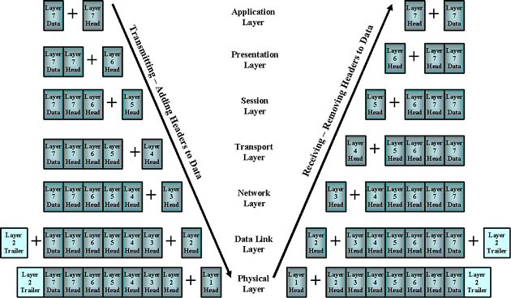

# Step 3: The OSI reference model

You should now be familiar with the various network devices, network cables, and network topology. To understand how data is processed through the network, you need to understand the communication model.

## History

Network engineers realized that a network communication standard was required to ensure that disparate networks could communicate with one another. In 1984, an organization known as the International Organization for Standardization (ISO) created a standard model which they called Open System Interconnection (OSI). The OSI model is a tool used to describe how network data packets are transported through the network.

A packet is a unit of data. It can vary in size depending on the data being sent, protocols being used, and other configurations set by the user and the network.

## OSI layers

In the OSI model there are seven layers.

*The OSI Model*

There are several common mnemonics that help in memorizing the order of the OSI Model layers, similar to the following examples.

* Layers 7 to 1 descending: All People Seem To Need Data Processing
* Layers 1 to 7 ascending: Please Do Not Touch Steve's Pet Alligator

Here is a detailed view of each network layer, its function, some corresponding protocols and associated hardware.

| Layer | Name         | Function                                                                                  | Example protocols                          | Format   | Network hardware   |
|-------|--------------|-------------------------------------------------------------------------------------------|--------------------------------------------|----------|--------------------|
| 7     | Application  | Interface between software applications and the network                                   | Telnet, HTTP, FTP, SSH                     | Data     |                    |
| 6     | Presentation | Handles encryption, message formatting, and compression                                   | ASCII, JPEG, PNG                           | Data     |                    |
| 5     | Session      | Manages applications and establishes, maintains, and terminates user connections          | Operating systems, scheduling              | Data     |                    |
| 4     | Transport    | Provides reliable or best-effort data delivery with optional error and flow control       | TCP, UDP                                   | Segments |                    |
| 3     | Network      | Provides logical end-to-end network addressing and routing                                | IP                                         | Packets  | Router             |
| 2     | Data Link    | Uses MAC addresses to access network devices. Provides error detection but no correction. | 802.3, 802.2, HDLC, FDDI, PPP, Frame relay | Frames   | Switch, Bridge     |
| 1     | Physical     | Bit stream. Specifies voltage, wire speed, and cable pin outs                             | EAI/TIA, V.35                              | Bits     | Hub, Repeater, NIC |
*OSI model detail*

## Data flow through the layers

From a high-level point of view, data flows from the network application (layer 7) down to the computer NIC card (layer 1). This means that the application sends the data onto the network, where it is routed by network devices until it reaches its destination. At this point, the data enters the computer at layer 1 (NIC card) and flows back up to layer 7 to be read on the destination computer application. To be transported on the network, data must enter and exit network devices at layer 1.

*Data Flow, Encapsulation and De-encapsulation*

When data is being prepared, headers are added at each layer. This is called encapsulation. Once the data is placed onto the network for transport, it is received at layer 1 by network devices. Each header is removed, and the embedded data for that layer is read as it travels up the stack. Removing the headers is called de-encapsulation. When data is being sent each layer adds its data and headers as the data is traveling down the stack to layer 1 where it is then sent onto the network.

## Questions to consider
1. On which layers do switches and routers operate?
2. If a network engineer discusses MAC address issues, to which OSI layer is she referring?
3. The TCP and UDP protocols operate on what OSI layer?
4. Which mnemonic will you use to remember the order of the OSI layers?

**Next Step:**  The TCP/IP Suite
