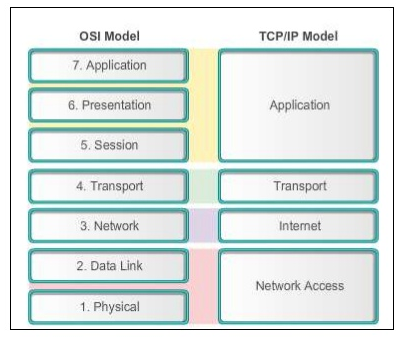

# Step 4: The TCP/IP suite

Another prevalent network communication model is the TCP/IP suite, also known as the TCP/IP Stack or IP Stack. This model simplifies the communication model by uniting a few layers of the 7-layer OSI model to form a 4-layer model. The TCP/IP Suite was released around the same time as the OSI model, and each has there supporters and detractors.

## TCP/IP layers

The TCP/IP Stack is sometimes presented as a 5-layer model because layer 1 and 2 are split rather than combined into one layer. Here, you'll see the 4-layer model here.

*TCP/IP Suite*

In the following table, the functionality of each layer is described. Essentially the functionality of the OSI layers 5, 6, and 7 are combined into layer 4 of the TCP/IP Stack. Layer 3 maps to layer 4 of the OSI model, and layer 2 maps to layer 3 of the OSI model. Finally, the OSI model layers 1 and 2 are combined into one layer called Network Access.

| Layer | Name           | Function                                                                                                                                                                                                                      | Example protocols                                         | Format       | Network hardware                   |
|-------|----------------|-------------------------------------------------------------------------------------------------------------------------------------------------------------------------------------------------------------------------------|-----------------------------------------------------------|--------------|------------------------------------|
| 4     | Application    | Provides network services to applications via services and protocols. Sockets and port numbers are used to differentiate the path and sessions on which applications operate. Message formatting and compression is provided. | Telnet, HTTP, FTP, SSH, JPG, Operating Systems Scheduling | Data         |                                    |
| 3     | Transport      | Provides reliable or best-effort data delivery with optional error and flow control                                                                                                                                           | TCP, UDP                                                  | Segments     |                                    |
| 2     | Internet       | Provides logical end-to-end network addressing and routing.                                                                                                                                                                   | IP                                                        | Packets      | Router                             |
| 1     | Network Access | Encapsulates IP packets into frames for transmission. Maps IP addresses to physical hardware addresses (MAC addresses) and uses protocols for physical data transmission.                                                     | 802.3, 802.2, HDLC, FDDI, PPP, Frame Relay                | Frames, Bits | Switch, Bridge, Hub, Repeater, NIC |
*TCP/IP Suite Functionality*

## Questions to consider
1. How is a Physical Topology different than a Logical one?
2. On what layer does data enter and leave a device?
3. What are encapsulation and de-encapsulation
4. What are the layers of the OSI Model?
5. What is the purpose of the OSI Model and TCP/IP Stack?

# Congratulations!  You have completed "Networking topologies and models"!
