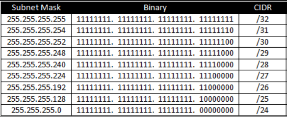

# Step 4: Subnet masks

A network can be divided into smaller networks called *subnets*. Subnets can be provided to individual organizational units, such as teams or business departments, to simplify the network and potentially make departmental data private. The subnet provides a specific range of IP addresses for a group of hosts use.

## What are subnet masks?

A subnet mask contains four bytes and can be written in the same format as an IP address. The mask divides an IP address into an extended network address and a host address. A host is any end user device such as a computer, printer, laptop, or tablet that connects to the network.

In a valid subnet mask, the first 1 to 3 bits must be set to `1`. These bits are the network portion of the subnet mask. The bits set to `0` are the host portion of the mask.

Each address class has a default subnet mask, as shown in the following table.

| **Class** | **Network bits** | **Host bits** | **Decimal address range** | **Subnet mask** |
|-----------|------------------|---------------|---------------------------|-----------------|
| A         | 8 bits           | 24 bits       | 1 to 127                  | 255.0.0.0       |
| B         | 16 bits          | 16 bits       | 128 to 191                | 255.255.0.0     |
| C         | 24 bits          | 8 bits        | 192 to 223                | 255.255.255.0   |
| D         | Reserved         | Reserved      | 224 to 239                | N/A             |
| E         | Reserved         | Reserved      | 240 to 255                | N/A             |

The following table offers another representation of subnet masks, showing the the component bytes in decimal and binary format.

<table>
 <tr>
  <td>&nbsp;</td>
  <td>1st octet</td>
  <td>2nd octet</td>
  <td>3rd octet</td>
  <td>4th octet</td>
 </tr>
 <tr>
  <td rowspan=3 >Class A</td>
  <td>Network</td>
  <td>Host</td>
  <td>Host</td>
  <td>Host</td>
 </tr>
 <tr>
  <td>255</td>
  <td>0</td>
  <td>0</td>
  <td>0</td>
 </tr>
 <tr>
  <td>11111111</td>
  <td>0</td>
  <td>0</td>
  <td>0</td>
 </tr>
 <tr>
  <td rowspan=3 >Class B</td>
  <td>Network</td>
  <td>Network</td>
  <td>Host</td>
  <td>Host</td>
 </tr>
 <tr>
  <td>255</td>
  <td>255</td>
  <td>0</td>
  <td>0</td>
 </tr>
 <tr>
  <td>11111111</td>
  <td>11111111</td>
  <td>0</td>
  <td>0</td>
 </tr>
 <tr>
  <td rowspan=3 >Class C</td>
  <td>Network</td>
  <td>Network</td>
  <td>Network</td>
  <td>Host</td>
 </tr>
 <tr>
  <td>255</td>
  <td>255</td>
  <td>255</td>
  <td>0</td>
 </tr>
 <tr>
  <td>11111111</td>
  <td>11111111</td>
  <td>11111111</td>
  <td>0</td>
 </tr>
</table>

## What is CIDR notation?

CIDR stands for Classless Inter-Domain Routing, and is a way of specifying the subnet mask for an IP address. When networks and subnets are created, the network engineer typically enters the IP address followed by the subnet mask. CIDR notation simplifies subnet notation. In CIDR notation, the number of subnet mask bits is converted into a single digit, which appears after the IP address.

For example, an IP address and subnet mask may be written as `192.168.5.12 255.255.255.128` In the subnet mask `255.255.255.128`, there are twenty-five bits specified. If you convert the subnet octets to binary, the result is `11111111.1111111.11111111.10000000`, which shows that there are twenty-five bits in the octet. CIDR notation takes this information and places it after the IP address, preceded by a forward slash: `192.168.5.12/25`.

*CIDR Notation*

## Quiz
1. What is subnet mask `255.255.128.0` in CIDR notation?
2. Write the subnet mask for CIDR `/21`.
3. Write the subnet mask for CIDR `/18`.
4. Express `192.168.24.12/27` in binary format for the IP address and subnet mask.
5. Express `10.5.21.12/12` in binary format for the IP address and subnet mask.
6. Write the subnet mask for `/12`.

Answers

<li>`/17`
<li>`255.255.248.0`
<li>`255.255.192.0`
<li>`11000000.10101000.00011000.00001100  11111111.11111111.11111111.11100000`
<li>`00001010.00000101.00010101.00001100  11111111.11110000.00000000.00000000`
<li>`255.240.0.0`
</ol>

**Next Step:**  Configuring subnets
